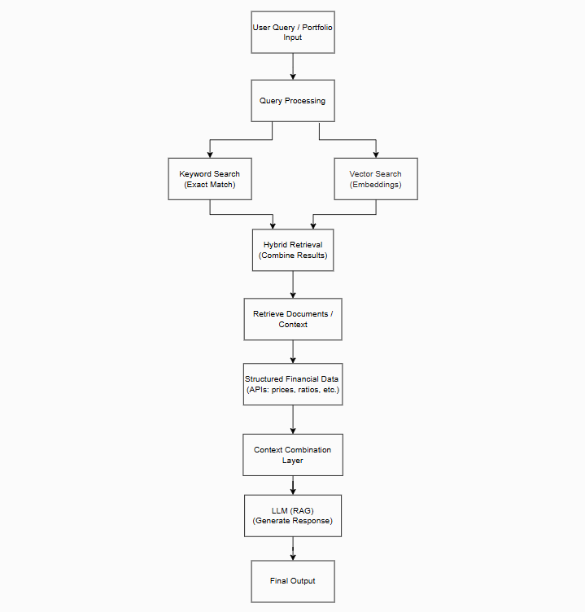

# System Architecture

## Overview
The application follows a modern full-stack architecture:

Frontend (React) → Backend API (FastAPI) → AI Pipeline → Data Layer

The system combines real-time financial data, AI retrieval systems, and LLM-based reasoning to generate insights.

---

## High-Level Architecture

User  
 ↓  
Frontend (React)  
 ↓  
FastAPI Backend (Python)  
 ↓  
AI Pipeline (Hybrid Search + RAG)  
 ↓   
Data Layer
- Financial APIs
- News APIs
- PostgreSQL (app data)
- Vector DB (embeddings)

---

---
## Components

### 1. Frontend (React)
- User interface for:
  - Portfolio input (CSV / manual)
  - Chat interface
  - News exploration
  - Risk dashboard
- Communicates with backend via REST API
- Handles:
  - Form submissions
  - Querying AI endpoints
  - Displaying hybrid search results and RAG-generated answers
- Designed to be reactive and modular for future feature expansion

---

### 2. Backend (FastAPI)
- Handles:
  - API routing
  - User requests
  - Portfolio parsing
  - Calls to AI pipeline
- Acts as the central orchestrator
- Integrates with databases:
  - SQLite (prototype)
  - PostgreSQL (planned production)
- Handles:
  - Validation
  - Logging
  - Session management (future)

---

### 3. AI Layer

- LLM: Llama 3 (via Ollama)
- Framework: LlamaIndex
- Responsible for:
  - Query processing
  - Hybrid retrieval (keyword + vector)
  - RAG-based response generation
  - Semantic similarity computation
  - Context-aware answer generation

📄 See `AI_PIPELINE.md` for detailed pipeline design.

---

### 4. Data Layer

#### Structured Data (External APIs)
- Financial metrics:
  - prices
  - volatility
  - fundamentals
  - sector data
- Retrieved in real-time from:
  - yfinance
  - Alpha Vantage
  - Polygon.io (future)
- Used for:
  - Portfolio analysis
  - Risk assessment
  - Dashboard metrics

---

#### Application Database (PostgreSQL)
- Stores:
  - User data (future)
  - Saved portfolios
  - Session data
- Used for:
  - Persistence
  - Fast retrieval of user-specific data
  - Backend query optimization

---

#### Unstructured Data (Vector Database)
- Stores:
  - News articles
  - Financial documents
  - Reports
- Data is:
  - Converted into embeddings
  - Stored for semantic search
  - Accessible for hybrid search pipelines
- Enables:
  - Vector search
  - RAG augmentation
  - Cross-document reasoning

---

## Example Flow (Portfolio Analysis)

1. User uploads portfolio
2. Backend parses tickers and weights
3. Fetch structured financial data from APIs
4. Retrieve relevant documents using hybrid search
5. Combine structured + unstructured data
6. Pass context into LLM (RAG)
7. Generate risk analysis response
8. Return results to frontend

---

## Design Principles

- Separation of concerns (frontend / backend / AI / data)
- Hybrid retrieval for accuracy + context
- Real-time data integration (APIs)
- Scalable architecture for future prototypes
- Modular components to allow easy addition of new AI features
