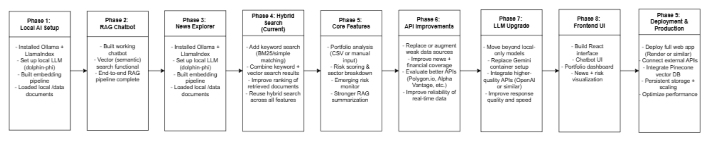
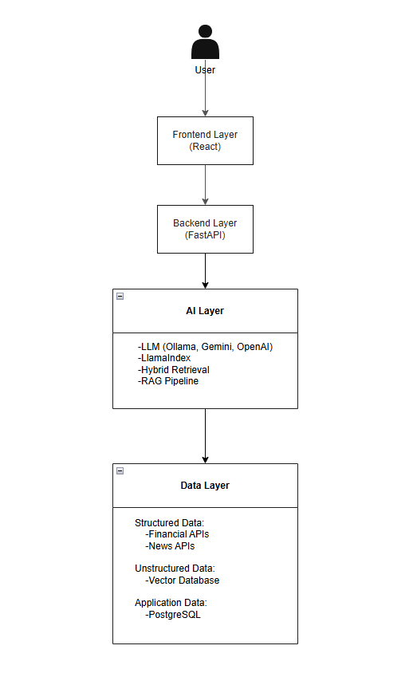

# AI-Portfolio-Assistant

AI-powered assistant for portfolio analysis, market insights, and emerging risk monitoring.

---

## Purpose
Web app designed to turn real-time financial and news data into actionable insights using:
- Keyword + semantic search
- Hybrid retrieval
- RAG-based AI reasoning

---

## Project Context
Personal project exploring modern AI pipelines (hybrid search + RAG) applied to:
- Portfolio analysis
- Risk assessment
- Market intelligence

---

## Overview
AIPortfolioAssistant helps users:
- Analyze portfolios and evaluate holdings
- Explore market and company news intelligently
- View interactive dashboards with risk scores, sector exposure, and emerging trends

---

## Features / Demonstrated AI Searches

### Portfolio Breakdown / Risk Assessment
- Upload portfolio (CSV or manual input)
- **Search:** Structured + hybrid retrieval (planned)
- **Goal:** Evaluate holdings and assign risk scores

### Financial Advice Chatbot
- Ask natural language finance questions
- **Search:** Hybrid retrieval + RAG (currently only RAG)
- **Goal:** Provide context-aware, AI-assisted answers from documents

### Market / Company News Explorer
- Explore news by ticker, company, or topic
- **Search:** Keyword + semantic search
- **Goal:** Retrieve relevant news efficiently

### Emerging Risk Monitor
- Dashboard highlights rising risks in portfolios or sectors
- **Search:** Structured data + hybrid retrieval + RAG summarization
- **Goal:** Detect early warning signals

---

## New Updates (Dynamic Website Branch: `web-service-deployment`)
- Connected Google’s free-tier Gemini API key
- Redid `chatbot.py` (RAG only, no hybrid yet) and `news_explorer.py` for Gemini API integration
- SQLite used for storing news API stories and other dynamic site data
- Verified SQLite files filter news correctly
- Added **4 diagrams** (timeline, architecture, AI pipeline, etc.)

---

## AI Stack (Current)
- **LLM:** Ollama (local, e.g., dolphin-phi)
- **RAG Framework:** LlamaIndex
- **Search:** Vector (semantic) search + RAG
- **Embeddings:** Ollama embedding models (local)

---

## Tech Stack (Planned)
- **Frontend:** React (Vite/Next.js)
- **Backend:** FastAPI (Python)
- **Vector Database:** Pinecone (planned)
- **Database:** PostgreSQL
- **Data Processing:** Pandas / NumPy

---

## Data Sources (Planned)
- Financial data: yfinance, Alpha Vantage, Polygon.io
- News data: NewsAPI, Finnhub

---

## Architecture & AI Pipeline
- See `docs/ARCHITECTURE.md` for system design  
- See `docs/AI_PIPELINE.md` for retrieval + RAG pipeline

---

## Concepts

**Vector Database:** stores embeddings for semantic similarity search  
**RAG (Retrieval-Augmented Generation):** retrieves relevant documents to feed LLM for accurate, grounded answers  
**Current RAG Data:** local `/data` text files with financial information

---

## Status
- **Financial Chatbot:** RAG functional locally, hybrid search pending  
- **News Explorer:** Gemini API prototype working with SQLite storage  
- **Portfolio Analysis & Risk Monitor:** in planning stage  
- **Vector Database Upgrade:** Pinecone planned, currently in-memory with LlamaIndex  
- **Full App Build:** backend (FastAPI) + frontend (React) under development

---

## Setup

### 1. Install dependencies
pip install -r requirements.txt

### 2. Install and run Ollama
Download Ollama: https://ollama.com

Pull required models:
ollama pull dolphin-phi  
ollama pull mxbai-embed-large  

Start Ollama (if not already running):
ollama run dolphin-phi

### 3. Run the Financial Advice Chatbot
python chatbot.py

Note: You can add your own financial documents into the data folder, to get responses more tailored to your specific situation. 

### 4. Run the Market / Company News Explorer (optional)
Replace the API key in news_explorer.py with your own free NewsAPI key: https://newsapi.org/register  
Run the script locally:
python news_explorer.py

Notes:
- Keyword search works well for tickers like AAPL
- Prototype is fully local; web interface not yet integrated

---

## Current Development Status & Future Improvements (Updated — March 25, 2026)

### Financial Advice Chatbot
- Current stage: **Financial Related Chatbot using RAG (local setup)**
  - Hybrid search is **NOT fully implemented yet**
    - Missing:
      - keyword search
      - combining keyword + vector results
  - Chatbot is fully **usable locally**
- Next Steps:
  - Implement keyword search layer
  - Merge results with vector search (true hybrid retrieval)
  - Improve prompt structure and response quality

---

### Market / Company News Explorer
- Local prototype implemented in `news_explorer.py` using:
  - Ollama (`dolphin-phi`) for LLM
  - Ollama embeddings (`mxbai-embed-large`)
  - NewsAPI (free key) as data source
- Keyword search works well for tickers like `AAPL`
- Limitations:
  - NewsAPI is not always up-to-date
  - Prototype only; needs larger datasets for better coverage
  - Possible enhancement: use a web search to find relevant articles first, then apply keyword + semantic search
- Currently fully local, no web interface yet
- Next Steps:
  - Expand hybrid keyword + semantic search
  - Add RAG summarization for concise company/news insights
  - Integrate with fresh and larger news sources
  - Connect to frontend once web app is hosted

---

### Portfolio Breakdown / Risk Assessment
- Development has **not started** yet
- Planned:
  - Build CSV upload + parsing system
  - Structured data analysis using Pandas
  - Hybrid search + RAG for company insights and risk scoring
  - Output: portfolio breakdown and risk metrics

---

### Emerging Risk Monitor
- Development has **not started** yet
- Planned:
  - Combine portfolio data with news signals
  - Use hybrid search + RAG summarization
  - Goal: detect early risk signals and surface insights in dashboard

---

### Vector Database Upgrade
- Current:
  - LlamaIndex in-memory vector store (local only)
- Planned:
  - Pinecone cloud vector database for:
    - Scalable datasets
    - Faster retrieval
    - Persistent storage
    - Production-ready infrastructure

---

### Full Application Build Plan (Backend + Frontend)
- Backend:
  - FastAPI for API endpoints
  - Connect RAG + search pipelines
- Frontend:
  - React (dashboard UI)
  - Portfolio visualization
  - Chatbot interface
- Next Steps:
  - Host web app (Render or other free/cloud option)
  - Integrate deployable AI features using API (OpenAI or other) instead of local-only models
---

### Deployment
- Move from local -> cloud deployment
- Host backend + frontend
- Connect Pinecone vector DB
- Prepare for real-world usage
